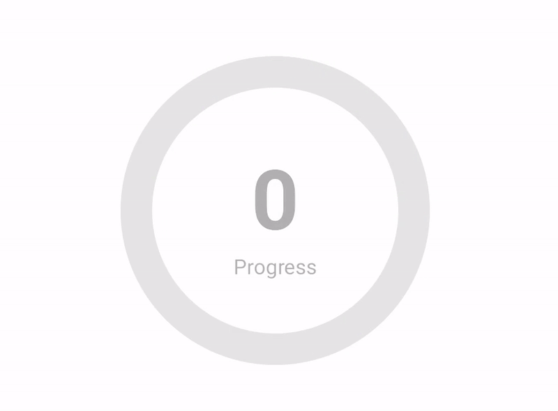

[](https://jitpack.io/#JyotimoyKashyap/CircularStats)  [](http://www.apache.org/licenses/LICENSE-2.0.html)

# CircularStats
This is a custom widget made with Jetpack Compose for displaying stats of different things such as progress or measurement. 

## How to add to your project
---
Add maven repository url to your project if not included 

1. Go to settings.gradle and add the following line
```
  allprojects {
		repositories {
			...
			maven { url 'https://jitpack.io' }
		}
	}
  
```

2. Add the following line to your build.gradle(:app) 'app level'
```
dependencies {
	implementation 'com.github.JyotimoyKashyap:CircularStats:0.0.1'
}
```

## Preview


## How to use ?
---
After adding the dependencies in your project simply call `CircularStats()`

### Basic Usage
```
CircularStats(
              canvasSize = 200.dp,
              indicatorValue = 100,
              progressTextColor = MaterialTheme.colors.onBackground
  )

```

Adding `canvasSize` and `indicatorValue` is mandatory but other parameters have default values which should work with your current theme. You can 


## LICENSE
---

 Copyright 2022 Jyotimoy Kashyap

   Licensed under the Apache License, Version 2.0 (the "License");
   you may not use this file except in compliance with the License.
   You may obtain a copy of the License at

       http://www.apache.org/licenses/LICENSE-2.0

   Unless required by applicable law or agreed to in writing, software
   distributed under the License is distributed on an "AS IS" BASIS,
   WITHOUT WARRANTIES OR CONDITIONS OF ANY KIND, either express or implied.
   See the License for the specific language governing permissions and
   limitations under the License.
